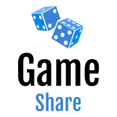

  
   

 

<h3 align='center'>Welcome! Please feel free to visit the live <a style='font-weight: bold' href='https://game-share-ltz.herokuapp.com'>demo.</a></h3>

Learn more about the developer <a style='font-weight: bold' href='https://www.nicholaslitz.com'>here</a>.

  <em>Please Note: this website does not have true transactions as it is under development.</em>

 

### Table of Contents
- [Game Share Overview](#game-share-overview)
- [Technologies Overview](#technologies-overview)
- [Front End](./client/)
- [Back End](./backend/)

Game Share Overview
====
Game Share is a web app that was spurred from the idea that board games are expensive and there are only a few ways to play before you pay. Why not have a small e-commerce site that allows users to share their board games with others.

Game Share uses [Board Game Atlas's API] to retrieve information for board games, expansions, and more. This allows Game Share to limit its database to user owned instances of board games reducing the size and complexity of the database.

### Deployed With:

 
 

### Front-End:

 
 

### Back-End:

 
 

 

  

 

Users can expolore board games, sign up, then buy, sell, trade, or borrow board games. The transaction experience is simple in order to maintain an elegant experience through the demo.

## Technologies Overview
### React
- The front-end is maintained by the React library for it's simplicity and modularity with components.

[Board Game Atlas's API]: https://www.boardgameatlas.com/api/docs/
